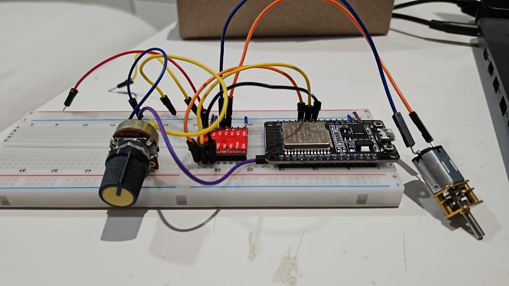

# Programa de Tareas
con una ESP32 le conectamos un potenciometro que regula el valor del voltaje y le da el movimiento al motor, tambien creamos las tareas que se mandan llamar

## Fotos de evidencia 

